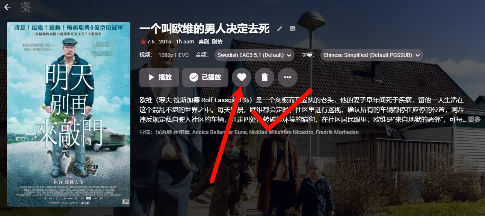
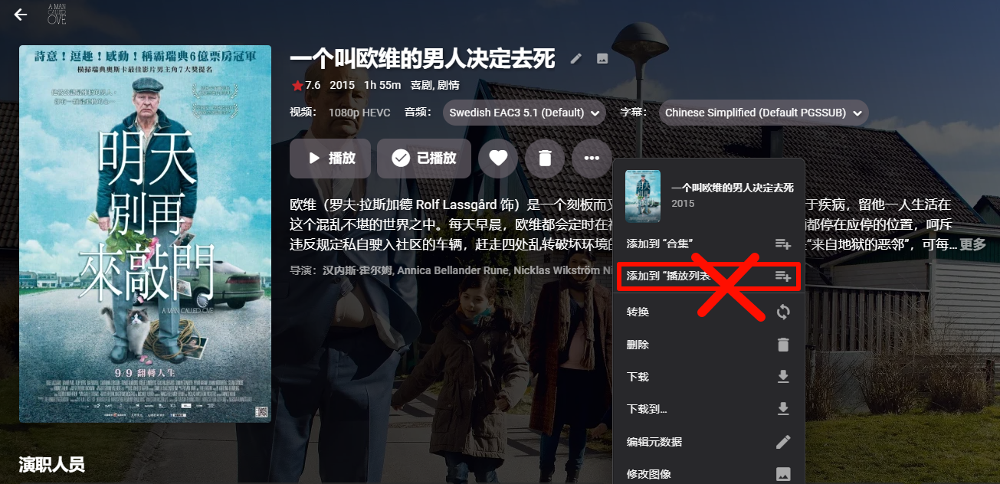

# Emby萌新指导

### 显示建议 

Emby界面设置：Emby右上角-应用程序设置-显示

**不要开启**显示每季里缺少的集功能

### 主屏幕建议 

Emby界面设置：Emby右上角-应用程序设置-主屏幕

* 调整在屏幕板块，建议如图设置
* 取消【隐藏已完全播放内容】
* 设定自己喜欢的媒体库显示顺序

### 播放/字幕建议 

Emby右上角-应用程序设置-播放 音频无所谓，视频选择源媒体直接传输或者尽可能高码的选项以获取更好的体验

Emby右上角-应用程序设置-字幕 为了方便，建议字幕喜好选择简体中文

### 禁止添加播放列表 

播放列表是公开内容，设定后所有人可见，多一个媒体库很丑。另外创建播放列表会启动Emby自身的扫库功能，所以不要使用为好

<figure><figcaption></figcaption></figure>

<figure><figcaption></figcaption></figure>
